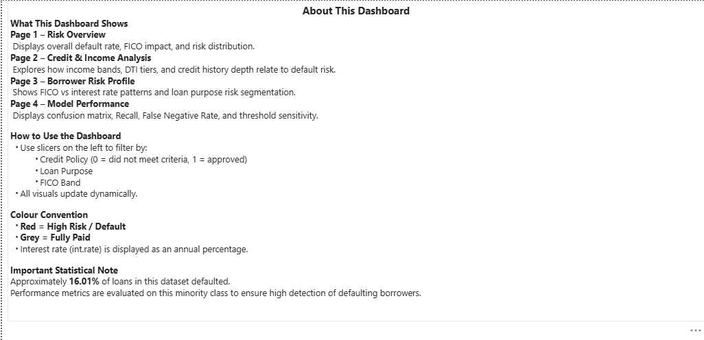
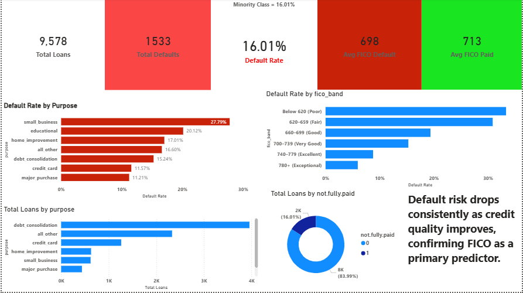
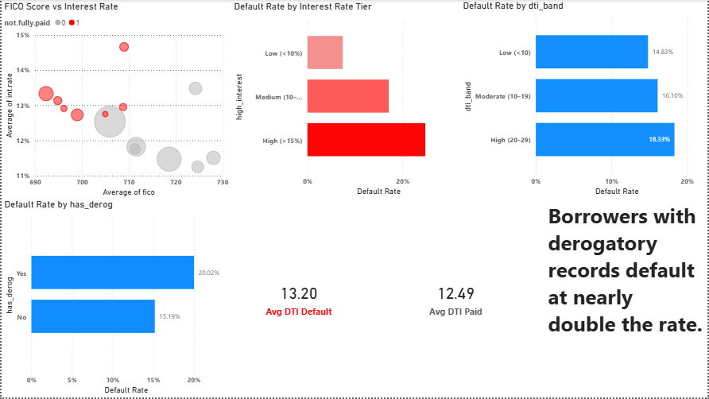
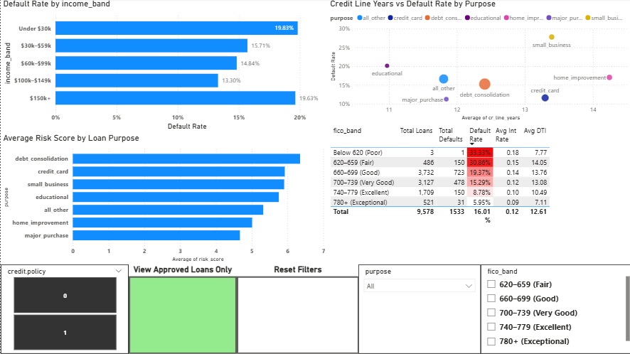
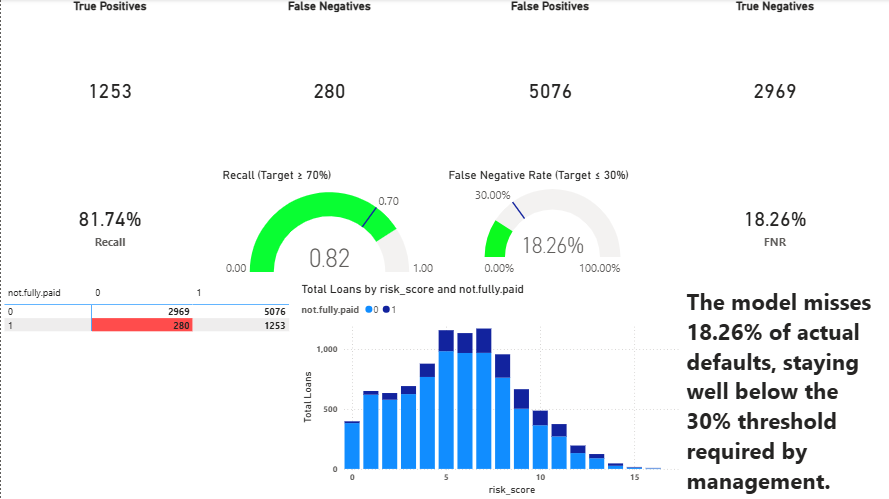

# Predicting Loan Default Using Risk Scoring & Power BI

This project develops an end-to-end loan default prediction model using 9,578 LendingClub loan records. The objective was to minimise missed defaults (false negatives) in a highly imbalanced dataset by building a transparent 17-point composite risk score and interactive Power BI dashboard.

---

## 📊 Key Findings

- Overall Default Rate: **16.01%**
- Simple FICO < 660 rule captures only **9.85%** of defaults
- Composite risk score achieves **82% Recall**
- False Negative Rate reduced to **18%**
- FICO score and interest rate are strongest predictors of default

---

## ⚖️ Class Imbalance (Critical Consideration)

Only **16.01%** of loans defaulted.

A naïve model predicting all loans as fully paid would achieve 84% accuracy but detect zero defaults.

This project explicitly optimised for **Recall on the minority class**, not overall accuracy.

---

## 📈 Model Performance

- Selected Threshold: ≥5  
- Recall: **82%**  
- False Negative Rate: **18%**

The model successfully identifies 8 out of every 10 defaulting borrowers.

---

## 🛠 Tools Used

Excel | Power BI | Statistical Testing

---

## 📊 Dashboard Screenshots

### Page 0 – About This Dashboard

### Page 1 – Risk Overview

### Page 2 – Credit & Income Analysis

### Page 3 – Borrower Risk Profile

### Page 4 – Model Performance

---

## 🗂 Repository Structure

- `/data` – 500-row dataset sample
- `/reports` – Milestone & Final reports
- `/dashboard` – Power BI files
- `/assets` – Dashboard screenshots
- `/excel` – Workbook access note

---

## 📂 How to Open the Dashboard

Download the `.pbix` file from the `/dashboard` folder and open using Power BI Desktop (free from Microsoft).

---

## ⚠️ Limitations

- Dataset represents a single time period
- Income data is self-reported
- Rule-based scoring model rather than logistic regression
- No time-series validation

---

## 📬 Contact

Timkama Udoka
email: timkamaudoka@gmail.com
LinkedIn: (https://www.linkedin.com/in/timkama-udoka)
